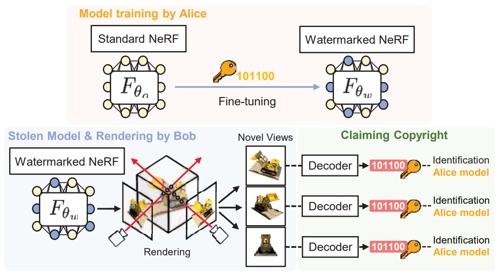

# WateRF: Robust Watermarks in Radiance Fields for Protection of Copyrights (CVPR 2024)
Youngdong Jang, Dong In Lee, MinHyuk Jang, Jong Wook Kim, Feng Yang, Sangpil Kim

Official Pytorch Implementation of WateRF.

Paper: [arXiv](https://arxiv.org/abs/2405.02066) | [CVPR 2024 Open Access](https://openaccess.thecvf.com/content/CVPR2024/html/Jang_WateRF_Robust_Watermarks_in_Radiance_Fields_for_Protection_of_Copyrights_CVPR_2024_paper.html)<br>
Project Page: https://kuai-lab.github.io/cvpr2024waterf/

<p align="center">
    
</p>

Abstract: *The advances in the Neural Radiance Fields (NeRF) research offer extensive applications in diverse domains, but protecting their copyrights has not yet been researched in depth. Recently, NeRF watermarking has been considered one of the pivotal solutions for safely deploying NeRF-based 3D representations. However, existing methods are designed to apply only to implicit or explicit NeRF representations. In this work, we introduce an innovative watermarking method that can be employed in both representations of NeRF. This is achieved by fine-tuning NeRF to embed binary messages in the rendering process. In detail, we propose utilizing the discrete wavelet transform in the NeRF space for watermarking. Furthermore, we adopt a deferred back-propagation technique and introduce a combination with the patch-wise loss to improve rendering quality and bit accuracy with minimum trade-offs. We evaluate our method in three different aspects: capacity, invisibility, and robustness of the embedded watermarks in the 2D-rendered images. Our method achieves state-of-the-art performance with faster training speed over the compared state-of-the-art methods.*

## Installation
First, clone the repository and create a new conda environment:
```bash
git clone https://github.com/kuai-lab/cvpr2024_WateRF.git
cd cvpr2024_WateRF
conda create -n WateRF python=3.9
conda activate WateRF
```
Next, install the required packages:
```bash
pip install torch torchvision  # Make sure to install the appropriate versions for your setup
pip install tqdm scikit-image opencv-python configargparse lpips icecream imageio-ffmpeg kornia tensorboard plyfile pytorch-wavelets pywavelets
```

## Data Preparation
To prepare the dataset and pre-trained weights for training and evaluation, follow these steps:

1. Download the NeRF dataset from [NeRF Datasets Link](https://drive.google.com/drive/folders/128yBriW1IG_3NJ5Rp7APSTZsJqdJdfc1).

2. Extract the downloaded dataset and place it in the `./data` directory. Your directory structure should look like this:
    ```
    cvpr2024_WateRF/
    ├── data/
    │   ├── NeRF_dataset/
    │   │   ├── llff/
    │   │   ├── syn/
    ├── assets/
    ├── configs/
    ├── train_watermarking_dwt.py
    └── ...
    ```

3. Download the TensoRF pre-trained weights from [TensoRF Pretrained Wieghts link](https://onedrive.live.com/?id=C624178FAB774B7!141&resid=C624178FAB774B7!141&authkey=!AKpIQCzsxSTyFXA&cid=0c624178fab774b7).

4. Place the pre-trained weights in the `./data/TensoRF_weights` directory. Your final directory structure should look like this:
    ```
    cvpr2024_WateRF/
    ├── data/
    │   ├── NeRF_dataset/
    │   │   ├── llff/
    │   │   ├── syn/
    │   ├── TensoRF_weights/
    │   │   ├── weight_file1.th
    │   │   └── weight_file2.th
    ├── assets/
    ├── configs/
    ├── train_watermarking_dwt.py
    └── ...
    ```

5. Download the weights for perceptual loss from [PerceptualSimilarity Github](https://github.com/SteffenCzolbe/PerceptualSimilarity) and place them in the `./loss/losses` directory. Your directory structure should now include:
    ```
    cvpr2024_WateRF/
    ├── data/
    │   ├── NeRF_dataset/
    │   │   ├── llff/
    │   │   ├── syn/
    │   ├── TensoRF_weights/
    │   │   ├── weight_file1.th
    │   │   └── weight_file2.th
    ├── loss/
    │   ├── losses/
    │   │   ├── rgb_watson_vgg_trial0.pth
    │   │   └── ...
    ├── assets/
    ├── configs/
    ├── train_watermarking_dwt.py
    └── ...
    ```

Ensure that the paths in your configuration files are set correctly to match the locations of the dataset, pre-trained weights, and loss weights.

## Usage
### Training
To train the model, run the following command:
```bash
python -u train_watermarking_dwt.py --config configs/lego.txt
```

### Rendering
To render images using the trained model, run:
```bash
python train_watermarking_dwt.py --config configs/lego.txt --ckpt path/to/your/watermarked_checkpoint --render_only 1 --render_test 1
```

## Citation
If you find our work useful in your research, please consider citing:
```bibtex
@inproceedings{jang2024waterf,
  title={WateRF: Robust Watermarks in Radiance Fields for Protection of Copyrights},
  author={Jang, Youngdong and Lee, Dong In and Jang, MinHyuk and Kim, Jong Wook and Yang, Feng and Kim, Sangpil},
  booktitle={Proceedings of the IEEE/CVF Conference on Computer Vision and Pattern Recognition},
  pages={12087--12097},
  year={2024}
}
```

## TO-DO List
- [ ] Load watermarked weights and result
- [ ] Add instructions for using a custom dataset
